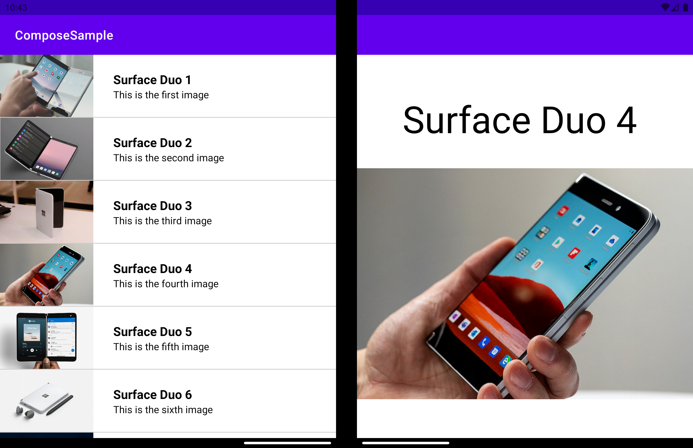

# ComposeSample

This sample is built with Jetpack Compose, the new UI framework in Android.

## Prerequisites

- Jetpack Compose version: `1.0.0-alpha01`

- Kotlin version: `1.4.0`

- Gradle version: `6.6-rc-6`

- Android Gradle plugin version: `4.2.0-alpha08`

- Android Studio version: `4.2 Canary 8`

- AndroidX WindowManager version: `1.0.0-alpha01`

## Getting Started

To learn how to load apps on the Surface Duo emulator, see the [documentation](https://docs.microsoft.com/dual-screen/android), and follow [the blog](https://devblogs.microsoft.com/surface-duo).

## Features

The sample uses [List-Detail](https://docs.microsoft.com/dual-screen/introduction#companion-pane) app pattern to show a list of image thumbnails in the single screen. When the app is spanned into two screens, it shows the full image in the other screen. To select the image item from the list will show the full image accordingly.

## Contributing

This project welcomes contributions and suggestions.  Most contributions require you to agree to a
Contributor License Agreement (CLA) declaring that you have the right to, and actually do, grant us
the rights to use your contribution. For details, visit https://cla.opensource.microsoft.com.

When you submit a pull request, a CLA bot will automatically determine whether you need to provide
a CLA and decorate the PR appropriately (e.g., status check, comment). Simply follow the instructions
provided by the bot. You will only need to do this once across all repos using our CLA.

This project has adopted the [Microsoft Open Source Code of Conduct](https://opensource.microsoft.com/codeofconduct/).
For more information see the [Code of Conduct FAQ](https://opensource.microsoft.com/codeofconduct/faq/) or
contact [opencode@microsoft.com](mailto:opencode@microsoft.com) with any additional questions or comments.

## License

Copyright (c) Microsoft Corporation.

MIT License

Permission is hereby granted, free of charge, to any person obtaining a copy of this software and associated documentation files (the "Software"), to deal in the Software without restriction, including without limitation the rights to use, copy, modify, merge, publish, distribute, sublicense, and/or sell copies of the Software, and to permit persons to whom the Software is furnished to do so, subject to the following conditions:

The above copyright notice and this permission notice shall be included in all copies or substantial portions of the Software.

THE SOFTWARE IS PROVIDED AS IS, WITHOUT WARRANTY OF ANY KIND, EXPRESS OR IMPLIED, INCLUDING BUT NOT LIMITED TO THE WARRANTIES OF MERCHANTABILITY, FITNESS FOR A PARTICULAR PURPOSE AND NONINFRINGEMENT. IN NO EVENT SHALL THE AUTHORS OR COPYRIGHT HOLDERS BE LIABLE FOR ANY CLAIM, DAMAGES OR OTHER LIABILITY, WHETHER IN AN ACTION OF CONTRACT, TORT OR OTHERWISE, ARISING FROM, OUT OF OR IN CONNECTION WITH THE SOFTWARE OR THE USE OR OTHER DEALINGS IN THE SOFTWARE.
