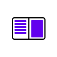
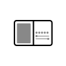
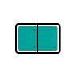
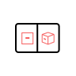
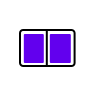
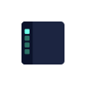

# Surface Duo Jetpack Compose samples

This repo contains the samples built in Jetpack Compose for Microsoft Surface Duo. These samples demonstrate [user interface patterns](https://docs.microsoft.com/dual-screen/introduction#dual-screen-app-patterns) with the new UI framework.

## Getting Started

When importing the code samples into Android Studio, use the **ComposeSamples** folder as the base directory of the project. This lets you access and run all of the samples from within the same project.

## Prerequisites

- Jetpack Compose version: `1.0.4`

- AndroidX WindowManager version: `1.0.0-beta02`

## Contents

| Sample | | Description |
|---|:---:|---|
| [ComposeGallery](https://github.com/microsoft/surface-duo-compose-samples/tree/main/ComposeSamples/ComposeGallery) |  | Sample with a Microsoft Surface Duo theme that shows how to use the [List Detail](https://docs.microsoft.com/dual-screen/introduction#list-detail) app pattern. |
| | |
| [CompanionPane](https://github.com/microsoft/surface-duo-compose-samples/tree/main/ComposeSamples/CompanionPane) |  | Photo editor sample that shows how to build the [Companion Pane](https://docs.microsoft.com/dual-screen/introduction#companion-pane) app pattern in Jetpack Compose. |
| | |
| [ExtendedCanvas](https://github.com/microsoft/surface-duo-compose-samples/tree/main/ComposeSamples/ExtendedCanvas) |  | Map sample that shows how to build the [Extended Canvas](https://docs.microsoft.com/dual-screen/introduction#extended-canvas) app pattern in Jetpack Compose. |
| | |
| [ListDetail](https://github.com/microsoft/surface-duo-compose-samples/tree/main/ComposeSamples/ListDetail) |  | Photo gallery sample that shows how to build the [List Detail](https://docs.microsoft.com/dual-screen/introduction#list-detail) app pattern in Jetpack Compose. |
| | |
| [DualView](https://github.com/microsoft/surface-duo-compose-samples/tree/main/ComposeSamples/DualView) |  | Restaurant finder sample that shows how to build the [Dual View](https://docs.microsoft.com/dual-screen/introduction#dual-view) app pattern in Jetpack Compose. |
| | |
| [Two Page](https://github.com/microsoft/surface-duo-compose-samples/tree/main/ComposeSamples/TwoPage) |  | E-reader sample that shows how to build the [Two Page](https://docs.microsoft.com/dual-screen/introduction#two-page) app pattern in Jetpack Compose. |
| | |
| [NavigationRail](https://github.com/microsoft/surface-duo-compose-samples/tree/main/ComposeSamples/NavigationRail) |  | Nature-themed sample that shows how to use a combination of [NavigationRail](https://material.io/components/navigation-rail) and [BottomNavigation](https://material.io/components/bottom-navigation) when building apps for large screen and foldable devices in Jetpack Compose. |
| | |

## Contributing

This project welcomes contributions and suggestions.  Most contributions require you to agree to a
Contributor License Agreement (CLA) declaring that you have the right to, and actually do, grant us
the rights to use your contribution. For details, visit https://cla.opensource.microsoft.com.

When you submit a pull request, a CLA bot will automatically determine whether you need to provide
a CLA and decorate the PR appropriately (e.g., status check, comment). Simply follow the instructions
provided by the bot. You will only need to do this once across all repos using our CLA.

This project has adopted the [Microsoft Open Source Code of Conduct](https://opensource.microsoft.com/codeofconduct/).
For more information see the [Code of Conduct FAQ](https://opensource.microsoft.com/codeofconduct/faq/) or
contact [opencode@microsoft.com](mailto:opencode@microsoft.com) with any additional questions or comments.

## License

Copyright (c) Microsoft Corporation.

MIT License

Permission is hereby granted, free of charge, to any person obtaining a copy of this software and associated documentation files (the "Software"), to deal in the Software without restriction, including without limitation the rights to use, copy, modify, merge, publish, distribute, sublicense, and/or sell copies of the Software, and to permit persons to whom the Software is furnished to do so, subject to the following conditions:

The above copyright notice and this permission notice shall be included in all copies or substantial portions of the Software.

THE SOFTWARE IS PROVIDED AS IS, WITHOUT WARRANTY OF ANY KIND, EXPRESS OR IMPLIED, INCLUDING BUT NOT LIMITED TO THE WARRANTIES OF MERCHANTABILITY, FITNESS FOR A PARTICULAR PURPOSE AND NONINFRINGEMENT. IN NO EVENT SHALL THE AUTHORS OR COPYRIGHT HOLDERS BE LIABLE FOR ANY CLAIM, DAMAGES OR OTHER LIABILITY, WHETHER IN AN ACTION OF CONTRACT, TORT OR OTHERWISE, ARISING FROM, OUT OF OR IN CONNECTION WITH THE SOFTWARE OR THE USE OR OTHER DEALINGS IN THE SOFTWARE.
