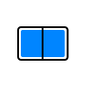

 

# Surface Duo Jetpack Compose Samples

This repo contains samples built with Jetpack Compose for the Microsoft Surface Duo and other large screen and foldable devices. These samples demonstrate our [dual-screen user interface patterns](https://docs.microsoft.com/dual-screen/introduction#dual-screen-app-patterns) with the new UI framework.

Please read the [code of conduct](CODE_OF_CONDUCT.md) and [contribution guidelines](CONTRIBUTING.md).

## Getting Started

When importing the code samples into Android Studio, use the repository directory as the base directory of the project. This lets you access and run all of the sample modules from within the same project.

To learn how to load apps on the Surface Duo emulator, see the [documentation](https://docs.microsoft.com/dual-screen/android), and follow [our blog](https://devblogs.microsoft.com/surface-duo).

Please check out our page on [Jetpack Compose for Microsoft Surface Duo](https://docs.microsoft.com/dual-screen/android/jetpack/compose/) for more details.

## Prerequisites

- Jetpack Compose version: `1.1.0-rc03`

- Jetpack WindowManager version: `1.0.0`

- Android Studio version: Bumblebee `2021.1.1`

## Microsoft Compose Libraries

The samples are built with Microsoft Compose libraries, [TwoPaneLayout](https://github.com/microsoft/surface-duo-compose-sdk/tree/main/TwoPaneLayout) and [WindowState](https://github.com/microsoft/surface-duo-compose-sdk/tree/main/WindowState).

## Contents

| Sample | | Description |
|---|:---:|---|
| [ComposeGallery](https://github.com/microsoft/surface-duo-compose-samples/tree/main/ComposeGallery) |  | Sample with a Microsoft Surface Duo theme that shows how to use the [List Detail](https://docs.microsoft.com/dual-screen/introduction#list-detail) app pattern. |
| | |
| [CompanionPane](https://github.com/microsoft/surface-duo-compose-samples/tree/main/CompanionPane) |  | Photo editor sample that shows how to build the [Companion Pane](https://docs.microsoft.com/dual-screen/introduction#companion-pane) app pattern in Jetpack Compose. |
| | |
| [ExtendedCanvas](https://github.com/microsoft/surface-duo-compose-samples/tree/main/ExtendedCanvas) |  | Map sample that shows how to build the [Extended Canvas](https://docs.microsoft.com/dual-screen/introduction#extended-canvas) app pattern in Jetpack Compose. |
| | |
| [ListDetail](https://github.com/microsoft/surface-duo-compose-samples/tree/main/ListDetail) |  | Photo gallery sample that shows how to build the [List Detail](https://docs.microsoft.com/dual-screen/introduction#list-detail) app pattern in Jetpack Compose. |
| | |
| [DualView](https://github.com/microsoft/surface-duo-compose-samples/tree/main/DualView) |  | Restaurant finder sample that shows how to build the [Dual View](https://docs.microsoft.com/dual-screen/introduction#dual-view) app pattern in Jetpack Compose. |
| | |
| [Two Page](https://github.com/microsoft/surface-duo-compose-samples/tree/main/TwoPage) |  | E-reader sample that shows how to build the [Two Page](https://docs.microsoft.com/dual-screen/introduction#two-page) app pattern in Jetpack Compose. |
| | |
| [NavigationRail](https://github.com/microsoft/surface-duo-compose-samples/tree/main/NavigationRail) |  | Nature-themed sample that shows how to use a combination of [NavigationRail](https://material.io/components/navigation-rail) and [BottomNavigation](https://material.io/components/bottom-navigation) when building apps for large screen and foldable devices in Jetpack Compose. |
| | |

## Social links

- [video: Jetpack Compose WindowState preview](https://www.twitch.tv/videos/1271211220)
- [blog: Jetpack Compose WindowState preview](https://devblogs.microsoft.com/surface-duo/jetpack-compose-windowstate-preview/)
- [video: Get started with Jetpack Compose Twitch](https://www.youtube.com/watch?v=ijXDWDtdiIE)
- [blog: Get started with Jetpack Compose](https://devblogs.microsoft.com/surface-duo/get-started-with-jetpack-compose/)
- [video: NavigationRail Compose sample Twitch](https://www.youtube.com/watch?v=pdoIyOU7Suk)
- [blog: NavigationRail Compose sample](https://devblogs.microsoft.com/surface-duo/jetpack-compose-navigation-rail/)
- [video: TwoPaneLayout Compose library Twitch](https://www.youtube.com/watch?v=Q66bR2jKdrg)
- [blog: New TwoPaneLayout Compose library preview](https://devblogs.microsoft.com/surface-duo/jetpack-compose-twopanelayout-preview/)
- [video: Jetpack Compose samples Twitch](https://www.youtube.com/watch?v=m8bMjFhBbN8)
- [blog: Jetpack Compose foldable and dual-screen development](https://devblogs.microsoft.com/surface-duo/jetpack-compose-foldable-samples)
- [blog: Jetpack Compose on Microsoft Surface Duo](https://devblogs.microsoft.com/surface-duo/jetpack-compose-dual-screen-sample/)

## Related links

- [Surface Duo Compose SDK](https://github.com/microsoft/surface-duo-compose-sdk/)
- [Jetpack Window Manager samples](https://github.com/microsoft/surface-duo-window-manager-samples)
- [SDK samples (Java)](https://github.com/microsoft/surface-duo-sdk-samples)
- [SDK samples (Kotlin)](https://github.com/microsoft/surface-duo-sdk-samples-kotlin)
- [Unity samples](https://github.com/microsoft/surface-duo-sdk-unity-samples)
- [Xamarin samples](https://github.com/microsoft/surface-duo-sdk-xamarin-samples)
- [Flutter samples](https://github.com/microsoft/surface-duo-sdk-samples-flutter)
- [React Native samples](https://github.com/microsoft/react-native-dualscreen)
- [Web samples](https://docs.microsoft.com/dual-screen/web/samples)

## Contributing

This project welcomes contributions and suggestions.  Most contributions require you to agree to a
Contributor License Agreement (CLA) declaring that you have the right to, and actually do, grant us
the rights to use your contribution. For details, visit https://cla.opensource.microsoft.com.

When you submit a pull request, a CLA bot will automatically determine whether you need to provide
a CLA and decorate the PR appropriately (e.g., status check, comment). Simply follow the instructions
provided by the bot. You will only need to do this once across all repos using our CLA.

This project has adopted the [Microsoft Open Source Code of Conduct](https://opensource.microsoft.com/codeofconduct/).
For more information see the [Code of Conduct FAQ](https://opensource.microsoft.com/codeofconduct/faq/) or
contact [opencode@microsoft.com](mailto:opencode@microsoft.com) with any additional questions or comments.

## License

Copyright (c) Microsoft Corporation.

MIT License

Permission is hereby granted, free of charge, to any person obtaining a copy of this software and associated documentation files (the "Software"), to deal in the Software without restriction, including without limitation the rights to use, copy, modify, merge, publish, distribute, sublicense, and/or sell copies of the Software, and to permit persons to whom the Software is furnished to do so, subject to the following conditions:

The above copyright notice and this permission notice shall be included in all copies or substantial portions of the Software.

THE SOFTWARE IS PROVIDED AS IS, WITHOUT WARRANTY OF ANY KIND, EXPRESS OR IMPLIED, INCLUDING BUT NOT LIMITED TO THE WARRANTIES OF MERCHANTABILITY, FITNESS FOR A PARTICULAR PURPOSE AND NONINFRINGEMENT. IN NO EVENT SHALL THE AUTHORS OR COPYRIGHT HOLDERS BE LIABLE FOR ANY CLAIM, DAMAGES OR OTHER LIABILITY, WHETHER IN AN ACTION OF CONTRACT, TORT OR OTHERWISE, ARISING FROM, OUT OF OR IN CONNECTION WITH THE SOFTWARE OR THE USE OR OTHER DEALINGS IN THE SOFTWARE.
