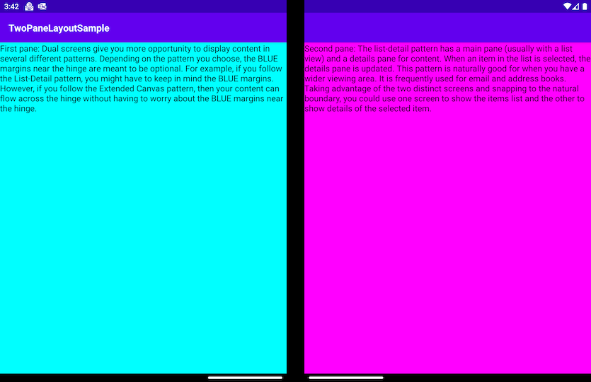
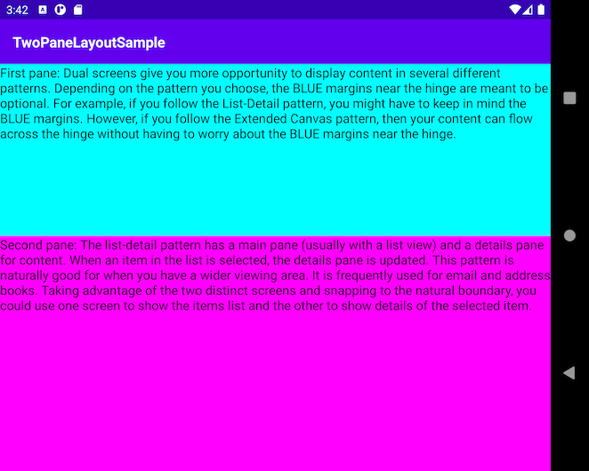
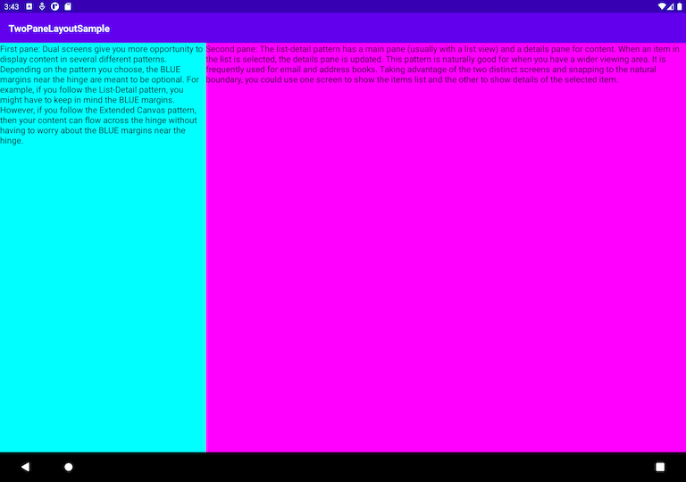
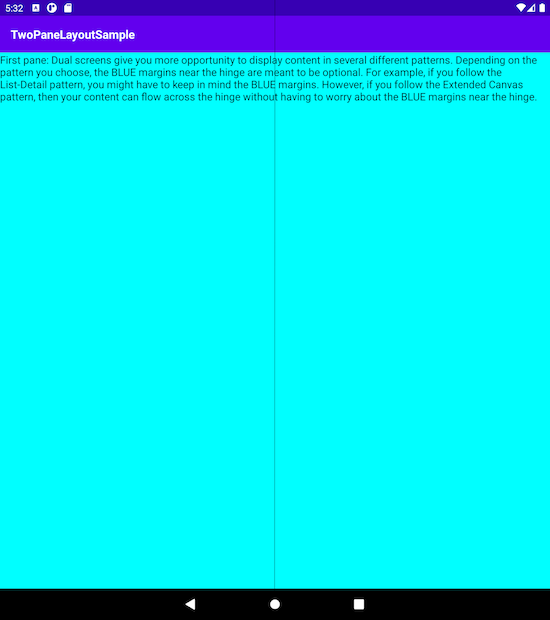
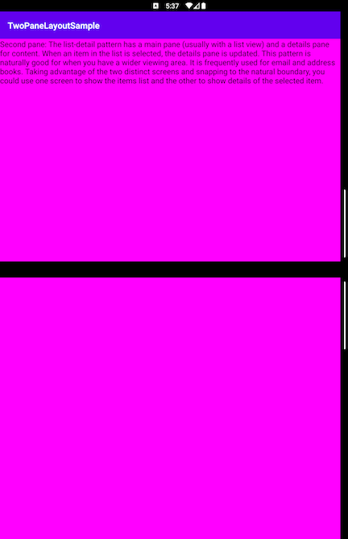

# TwoPaneLayout - Surface Duo Compose SDK

**TwoPaneLayout** is a UI component for Jetpack Compose, which contains the layouts that help you create UI for dual-screen, foldable, and large-screen devices. TwoPaneLayout provides a two-pane layout for use at the top level of a UI. The component will place two panes side-by-side on dual-screen, foldable and large-screen devices and one pane only on regular single-screen devices. The two panes can be horizontal or vertical, based on the orientation of the device, unless `paneMode` is configured.

The elements will be layout based on the order, which means the first element will be placed in the first pane and the second element will be placed in the second pane. The TwoPaneLayout is able to assign children widths according to their weights provided using the `TwoPaneScope.weight` modifier.

```
@Composable
fun TwoPaneLayout(
    modifier: Modifier = Modifier,
    paneMode: TwoPaneMode = TwoPaneMode.TwoPane,
    firstPane: @Composable TwoPaneScope.() -> Unit,
    secondPane: @Composable TwoPaneScope.() -> Unit
)
```

Please refer to [user interface patterns](https://docs.microsoft.com/dual-screen/introduction#dual-screen-app-patterns) to learn about some common use case for the two panes.

## 

## Add to your project

1. Make sure you have **mavenCentral()** repository in your top level **build.gradle** file:

    ```gradle
    allprojects {
        repositories {
            google()
            mavenCentral()
         }
    }
    ```

2. Add dependencies to the module-level **build.gradle** file (current version may be different from what's shown here).
    ```gradle
    implementation "com.microsoft.device.dualscreen:twopanelayout:1.0.0-alpha04"
    ```
3. Also ensure the compileSdkVersion and targetSdkVersion are set to API 30 or newer in the module-level build.gradle file 

    ```
    android { 
        compileSdkVersion 30
        
        defaultConfig { 
            targetSdkVersion 30 
        } 
        ... 
    }
    ```

4. Build layout with **TwoPaneLayout**. Please refer to the [sample](https://github.com/microsoft/surface-duo-compose-samples/tree/main/TwoPaneLayout/sample) for more details.

- Dual-screen device(Surface Duo device, 1:1)



- Foldabe device(1:1)



- Tablet device(3:7)



- VerticalSingle on Foldable



- HorizontalSingle on Dual-screen device



## Contributing

This project welcomes contributions and suggestions.  Most contributions require you to agree to a
Contributor License Agreement (CLA) declaring that you have the right to, and actually do, grant us
the rights to use your contribution. For details, visit https://cla.opensource.microsoft.com.

When you submit a pull request, a CLA bot will automatically determine whether you need to provide
a CLA and decorate the PR appropriately (e.g., status check, comment). Simply follow the instructions
provided by the bot. You will only need to do this once across all repos using our CLA.

This project has adopted the [Microsoft Open Source Code of Conduct](https://opensource.microsoft.com/codeofconduct/).
For more information see the [Code of Conduct FAQ](https://opensource.microsoft.com/codeofconduct/faq/) or
contact [opencode@microsoft.com](mailto:opencode@microsoft.com) with any additional questions or comments.

## License

Copyright (c) Microsoft Corporation.

MIT License

Permission is hereby granted, free of charge, to any person obtaining a copy of this software and associated documentation files (the "Software"), to deal in the Software without restriction, including without limitation the rights to use, copy, modify, merge, publish, distribute, sublicense, and/or sell copies of the Software, and to permit persons to whom the Software is furnished to do so, subject to the following conditions:

The above copyright notice and this permission notice shall be included in all copies or substantial portions of the Software.

THE SOFTWARE IS PROVIDED AS IS, WITHOUT WARRANTY OF ANY KIND, EXPRESS OR IMPLIED, INCLUDING BUT NOT LIMITED TO THE WARRANTIES OF MERCHANTABILITY, FITNESS FOR A PARTICULAR PURPOSE AND NONINFRINGEMENT. IN NO EVENT SHALL THE AUTHORS OR COPYRIGHT HOLDERS BE LIABLE FOR ANY CLAIM, DAMAGES OR OTHER LIABILITY, WHETHER IN AN ACTION OF CONTRACT, TORT OR OTHERWISE, ARISING FROM, OUT OF OR IN CONNECTION WITH THE SOFTWARE OR THE USE OR OTHER DEALINGS IN THE SOFTWARE.
